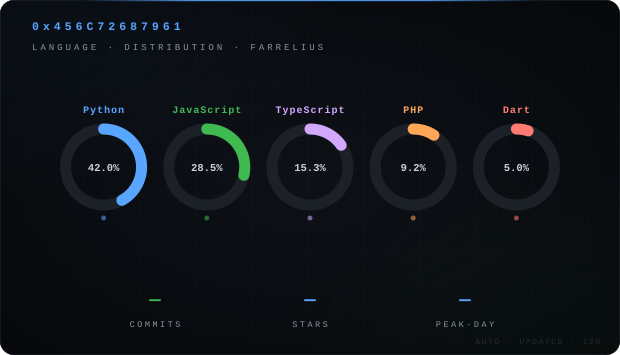
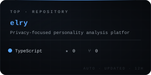

<!-- header.svg, stats.svg, top-repo.svg — auto-generated every 12h via .github/workflows/main.yml -->

<div align="center">




</div>

---

```
> whoami
  Farrelius · age=18 · focus=Mathematical Logic & System Architecture
```

---

### stack

```
frontend  →  React · Flutter · ES6+ · Tailwind
backend   →  Laravel · FastAPI · Node.js
logic     →  Math.js · React Flow
tools     →  Git · Vercel · Postman
```

---

### projects

```
elry      [production]  Privacy-focused personality analysis platform
          → https://elry-test.vercel.app

concato   [utility]     Local-first codebase merging for AI context
          → https://concato.vercel.app
```

---

<div align="center">

[](https://github.com/Farrelius)

[](https://github.com/Farrelius)


</div>